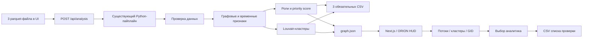

# STRATA — исследование денежных потоков

Объяснимый аналитический инструмент для AML-аналитика банка. STRATA восстанавливает
структуру финансовой сети по обезличенным транзакциям, присваивает каждому узлу
роль и формирует приоритетную очередь для углублённой проверки.

Главный вопрос продукта: **кого проверить первым и почему?**

> Роли и приоритеты являются гипотезами для проверки. Они не доказывают
> причастность клиента к незаконной деятельности.

## Что реализовано

- загрузка трёх parquet через UI и настоящий серверный запуск существующего Python-пайплайна;
- предзагруженный комплект организаторов как второй вход того же расчёта, без mock/fallback;
- воспроизводимый локальный пайплайн от трёх parquet-файлов до результатов;
- проверка консистентности агрегированных рёбер и отдельных транзакций;
- структурные метрики: степени, обороты, PageRank, betweenness и достижимость из seed;
- временные признаки прохождения средств в течение одного-двух дней;
- шесть объяснимых ролей и `role_score` для всех 2 248 узлов;
- детерминированная кластеризация Louvain, включая изолированные seed;
- отдельный `priority_score` и топ-50 узлов с числовым обоснованием;
- защита от ложных terminal-ролей на границе четвёртого колена;
- интерактивный интерфейс: точный поиск 18-значного GID, карточка узла и направленный ego-граф;
- обзор всех кластеров: размер, seed, внутренний оборот, гипотеза и переход к участникам;
- фильтры по роли и кластеру для топ-50 и всей сети;
- обзор направленных межкластерных потоков с постраничной навигацией и seed;
- один кратчайший направленный путь от исходных клиентов к выбранному GID;
- выбранный аналитиком список проверки: один клик, массовый выбор первых десяти, отмена, экспорт CSV;
- временные сигналы, объяснимые аномалии, встречные потоки и оценка устойчивости сети;
- повторяющиеся цепочки A→B→C и циклы длиной 3–4 с проверкой календарных дат;
- AI-ассистент: естественный язык → ограниченный запрос → проверяемые факты и ссылки на GID;
- скачивание трёх обязательных CSV текущего расчёта непосредственно из UI;
- явные состояния загрузки, ошибки и пустого результата без подмены демоданными;
- автоматический валидатор обязательных схем и ограничений.

## Как работает решение

1. Исходные GID правоохранительных органов уже отмечены как `is_seed` в
   `nodes.parquet`. У комплекта организаторов их 81; интерфейс не хранит эту
   константу, а считает seed из результата, сохранившего признак входных данных.
2. Аналитик нажимает «Начать исследование» для реального комплекта из `data/`.
   Для другого комплекта выбирает «Своя выгрузка» и перетаскивает вместе
   `nodes.parquet`, `edges.parquet`, `transactions.parquet`. Недостающие файлы
   можно добавить отдельно; запуск доступен после выбора полного комплекта.
3. `POST /api/analysis` копирует входные данные в отдельную временную папку,
   вызывает `pipeline/main.py` и ждёт его завершения. Алгоритмы ролей и score
   не переписаны. Пайплайн создаёт три CSV, `graph.json` и `run_log.json` внутри
   этой папки; сервер возвращает граф и паспорт расчёта в UI. Общие `data/`,
   `out/` и `public/data/` при запуске через UI не меняются.
4. Аналитик изучает направленные потоки между кластерами, открывает кластер
   и участника либо использует точный поиск GID по всей сети.
5. В топе видны приоритет, evidence/why, входящие и исходящие суммы. Аналитик
   добавляет нужные GID в «Мой список проверки» из топа или карточки узла.
6. Список можно редактировать и выгрузить кнопкой «Экспортировать список в CSV».
   Экспортируются только выбранные записи, исходные оценки, обоснования,
   ограничения наблюдения, период и идентификатор расчёта.

Во время запроса UI честно ожидает Python: нет процентов готовности, таймерной
имитации этапов или подмены результата mock-данными. Экран показывает ожидание,
затем результат; журнал этапов доступен в ответе API и CLI-экспорте `run_log.json`.
Ошибки содержат причину и действие для исправления, выбранные файлы сохраняются
для повторной попытки. Неуспешный новый запуск не уничтожает предыдущий результат.

Рабочий экран объединяет очередь и полноширинную схему потоков; справка открывается
кнопкой «Справка» в боковой панели. Подробности
временных сигналов, полноты и кластера раскрываются по запросу. Клик по узлу
синхронно меняет граф и карточку; стрелка назад возвращает предыдущий узел.
Поиск работает по всей сети независимо от фильтров. Очередь переключается
между топ-50 и всеми узлами (по 100 строк), не пересчитывая исходные score.

В «Денежных потоках» входы расположены слева, выбранный клиент в центре, выходы справа.
Контрагенты отсортированы по сумме и показаны по четыре на каждой стороне;
остальные доступны стрелками страниц. На карточке видны полный GID, роль,
сумма, число операций и доля в соответствующей стороне потока. Толщина линии
связана с суммой; стрелки направлены слева направо. Цвет полосы — роль, метка seed —
исходный клиент. Клик по карточке делает контрагента новым центром исследования.
Самопереводы вынесены отдельно, но учтены в общих суммах выбранного клиента.
Анимация показывает только направление, не онлайн-транзакции; её можно
остановить, также учитывается `prefers-reduced-motion`.

«Путь от источника» строится BFS по направленным рёбрам: это один кратчайший
наблюдаемый путь, не доказательство движения одних и тех же средств.
«Между кластерами» использует такую же схему: входящие кластеры → выбранный →
исходящие. Все кластеры доступны через селектор, связи — страницами по четыре.
Клик по соседнему кластеру переносит фокус, «Открыть клиентов» переводит к его
участникам и ведущему по приоритету узлу.

Список проверки хранится только в текущей вкладке и не переживает перезагрузку.
Перед новым успешным расчётом непустой список требует явного согласия на сброс;
его можно предварительно экспортировать. CSV — UTF-8 с BOM, запятые, кавычки по
RFC 4180. GID записываются строками без `Number()`. При импорте в Excel задайте
столбцу `gid` тип **Текст**: сам CSV не содержит типов и не запрещает Excel
автоматически округлить длинное число.

## Технологии

- Python 3.11–3.13, pandas, PyArrow, NumPy, SciPy, NetworkX;
- uv и зафиксированные зависимости в `uv.lock`;
- Next.js 16, React 19, TypeScript, Tailwind CSS 4, shadcn/ui;
- ORION HUD: тема, фон-шейдер, motion-хелперы и референсная галерея.

Опциональный AI-ассистент использует установленный OpenAI SDK и Responses API
со строгой JSON-схемой. Модель выбирается только через `OPENAI_MODEL`; обязательный
пайплайн, граф, роли, сигналы и экспорт работают без ключа и внешних сервисов.

## Архитектура проекта



- `pipeline/src/money_graph/` — расчёты, правила, экспорт и валидация;
- `data/` — обезличенные данные организаторов;
- `out/` — пересчитываемые CSV, не коммитятся;
- `public/data/graph.json` и `run_log.json` — постоянный экспорт CLI и его журнал (UI получает новый результат через API);
- `components/agent/` — интерактивный сценарий аналитика;
- `app/api/analysis/route.ts`, `lib/server/run-analysis.ts` — загрузка, изолированный запуск и ошибки;
- `lib/server/analysis-store.ts` — ограниченный кэш результатов и трёх CSV;
- `app/api/analysis/[id]/[file]/route.ts` — скачивание CSV именно текущего запуска;
- `app/api/assistant/route.ts` — разбор вопроса через OpenAI, проверка плана и локальное выполнение;
- `lib/review-list.ts` — выбранные GID и безопасный CSV-экспорт;
- `lib/graph-investigation.ts` — направленные пути, встречные потоки, устойчивость и полнота;
- `pipeline/src/money_graph/diagnostics.py` — описательные сигналы по реальным транзакциям;
- `pipeline/src/money_graph/routes.py` — повторяющиеся цепочки и ограниченный поиск циклов;
- `lib/graph-types.ts` — контракт между результатами пайплайна и интерфейсом.

## Правила ролей

Роль выбирается только среди формально допустимых кандидатов. Если подходит
несколько ролей, выбирается роль с наибольшим специализированным score.

| Роль | Формальное условие-кандидат | Основные сигналы уверенности |
|---|---|---|
| `consolidator` | не seed, не `depth=4`; ≥3 отправителей; удержание ≥35% либо входящих контрагентов больше исходящих | число и сумма входов, удержание, число достижимых seed |
| `transit` | не seed, есть вход и выход; отношение `out_kzt / in_kzt` от 0,7 до 1,3 | близость коэффициента к 1, быстрый выход ≤2 дней, betweenness |
| `distributor` | ≥10 получателей; получателей минимум в 1,5 раза больше отправителей | веерность, исходящая сумма и число переводов |
| `terminal` | не seed, `depth<4`, есть вход; выхода нет либо ушло ≤15% входящего | удержание, входящая сумма и число отправителей |
| `coordinator` | ≥2 входящих и ≥2 исходящих контрагента; процентильный ранг betweenness ≥0,85 либо достижимость из ≥7 seed | betweenness, PageRank, seed reach и двусторонняя связность |
| `peripheral` | ни одно из условий выше не выполнено | отсутствие сильного сигнала; отдельно объясняется изоляция или обрыв `depth=4` |

У seed не используются роли, основанные на полном входящем балансе: граф собран
от них по исходящим переводам, поэтому их `in_kzt` системно занижен.

## Приоритет

`priority_score` не равен уверенности в роли. Он отвечает на вопрос очерёдности
проверки и строится как нормированная комбинация:

- 30% — сигнал координатора;
- 20% — сигнал консолидации;
- 16% — сигнал распределения;
- 12% — сигнал транзита;
- 10% — PageRank;
- 8% — betweenness;
- 4% — достижимость из seed;
- небольшой бонус ранее неизвестным, не-seed узлам.

Для изолированных и обрезанных четвёртым коленом узлов применяется понижающий
коэффициент.

## Дополнительная аналитика

Сигналы ниже не меняют роли и приоритеты и не являются доказательством нарушения.

| Опция кейса | Реализация и границы |
|---|---|
| Обрыв на четвёртом колене | `depth=4` исключён из terminal; карточка объясняет необходимость следующего колена |
| Временные паттерны | Быстрый выход ≤2 дней; ≥3 уникальных плательщиков за календарный день; всплеск ≥5 операций и ≥3 средних дневных значений |
| Повторяющиеся маршруты и возвраты | Повторные рёбра, пары A↔B, A→B→C в ≥2 разных дня начала; структурные циклы длиной 3–4 с отдельным числом совпадений по датам |
| Аномалии | Оборот выше Q3 + 1,5 IQR среди своего колена (≥4 узлов); ≥3 исходящих переводов от 5 000 до <10 000 ₸ за день — только повод проверить дробление |
| Устойчивость | Удаление топ-1/3/5/10: слабые компоненты, крупнейшая компонента, доля потерявших связность пар среди оставшихся узлов |
| AI-ассистент | Справка, входы/выходы, общие прямые получатели, путь от seed, приоритеты, маршруты и полнота; факты рассчитываются локально, ссылки открывают GID |
| Карточка узла | Автоматическая справка по правилам: роль, evidence, потоки, связи, сигналы и ограничения; без LLM |
| Полнота | Запрос следующего колена, полной выписки seed, операций вне банка/порога/периода в зависимости от узла |

Дневная активность — сумма входящих и исходящих операций, собственный перевод
учитывается один раз и не считается отдельным плательщиком в синхронных входах.
Среднее рассчитано по всем календарным дням между первой
и последней транзакцией выборки, включая дни без операций. Синхронность означает
совпадение даты, не времени внутри суток и не координацию участников.
Диапазон 5–10 тыс. ₸ — исследовательское правило относительно нижнего порога
выгрузки, а не законодательный порог. Без клиентских профилей и контрольной
выборки качество детекции нарушений не измерено.

Устойчивость — структурный сценарий на слабой связности. Для корректного сравнения
до и после используются одни и те же оставшиеся узлы, чтобы само удаление
вершин не считалось фрагментацией. Это не прогноз поведения людей или
перераспределения денег после блокировки.

Маршруты: между каждой парой соседних переводов допускается 0–2 календарных дня.
Внутри каждого маршрута жадное сопоставление не использует одну операцию дважды;
между разными маршрутами операции могут повторяться. Это не сопоставление сумм
и не доказательство движения одних и тех же средств; порядок внутри дня неизвестен.
Циклы проверяются со всех возможных стартовых вершин, выбирается вариант с
максимальным числом совпадений. Цикл с нулём совпадений — только структурный.
На приложенном комплекте найдены 139 цепочек и 210 циклов; сохраняются первые 50
каждого типа и до трёх примеров дат. Бюджет: 200 000 кандидатов цепочек и 200 000
шагов поиска циклов, максимум 2 000 обнаруженных циклов. Достижение лимита явно
отмечается; полнота при лимите не гарантируется. Эти сигналы не меняют основной топ.

### Как устроен AI-ассистент

1. Пользователь нажимает «Спросить по графу». Отдельной галочки нет; рядом с
   отправкой постоянно видно уведомление об OpenAI. Нельзя вводить персональные
   или конфиденциальные сведения; публичное демо предназначено только для обезличенного кейса.
2. Сервер проверяет расчёт и GID. Реальные идентификаторы заменяются временными
   `N1`, `N2` и т. п.; передаются вопрос, псевдоним открытого клиента и первые
   десять клиентов из списка проверки. Граф, суммы и parquet модели не передаются.
   Произвольный текст вопроса не является автоматически обезличенным.
3. Responses API возвращает только намерение и допустимые псевдонимы по строгой
   JSON-схеме (`store: false`). LLM не пишет финансовую справку свободным текстом.
4. Сервер проверяет план и выполняет ограниченный запрос по сохранённому графу.
   Суммы, роли, обоснования и GID берутся только из этого расчёта. Нажатие ссылки
   в ответе открывает клиента на схеме. Предыдущие реплики модели не передаются.

Не поддерживаются произвольный SQL, произвольные числовые фильтры, обогащение,
установление личности/виновности и изменение результатов. Возможна ошибка
классификации намерения — заголовок ответа показывает выполненный запрос.
У общих получателей проверяется пересечение прямых исходящих связей всех
указанных клиентов, а не объединение. Ответ ограничен первыми десятью; маршруты —
пятью цепочками и пятью циклами из сохранённых результатов. Запросы независимы.
Нет mock fallback: ошибки ключа, квоты, модели и разбора показываются явно.

## Установка и запуск

Требования: Node.js 22.6+ (включая тесты), npm и [uv](https://docs.astral.sh/uv/).
Нужен Node-сервер с Python 3.11–3.13; статический хостинг не подходит.

**Одна команда из корня клонированного репозитория:**

```bash
npm run demo
```

Команда устанавливает зафиксированные JS/Python-зависимости, пересчитывает
обязательные CSV в `out/` и запускает интерфейс. Для первой установки нужна сеть.
После установки весь обязательный сценарий работает без OpenAI и без облака.
Node.js, npm и uv должны быть установлены заранее.

Те же шаги по отдельности, без предварительного CLI-пересчёта:

```bash
npm ci
uv sync --project pipeline --locked
npm run dev
```

Интерфейс откроется на [http://localhost:3000](http://localhost:3000).

Дальше весь сценарий, включая реальный расчёт, выполняется в браузере.
Сервер использует `pipeline/.venv/bin/python` (на Windows — `Scripts/python.exe`).
При нестандартном окружении задайте абсолютный путь `ORION_PYTHON` в `.env.local`.
До первого показа подготовьте окружение через `uv sync`: HTTP-запросы не
устанавливают зависимости и не требуют внешней сети.

Production-проверка локально: `npm run build && npm run start`.

Для опционального AI-чата заполните локальный `.env.local` по `.env.example`:

```dotenv
OPENAI_API_KEY=ваш_ключ_только_локально
OPENAI_MODEL=доступная_вашему_API_проекту_модель
```

Перезапустите сервер после изменения окружения. Нужна модель с Responses API и
Structured Outputs; имя выбранной модели показывается в чате. Ключ остаётся на
сервере, `.env.local` исключён из Git. Использование API оплачивается отдельно;
это не условие работы обязательной аналитики. Проверенный в локальном smoke-тесте
вариант — `gpt-6-sol`, не жёстко заданный default. Запрос ограничен 1 200 символами,
45 секундами ожидания и 1 600 выходными токенами; автоматических повторов нет.

Дополнительный CLI-путь `npm run analyze` использует `uv.lock` и создаёт постоянные:

- `out/nodes_roles.csv`;
- `out/clusters.csv`;
- `out/top_nodes.csv`;
- `out/graph.json` (внутренний экспорт);
- `public/data/graph.json` и `public/data/run_log.json`.

Python-часть не требует ручного создания virtualenv и не использует внешние API.

### Ограничения серверного запуска

- до 25 МиБ на каждый входной файл; принимаются только три заданных имени;
- проверяются размер, сигнатура parquet и схемы/согласованность существующим пайплайном;
- один расчёт на процесс сервера, второй получает понятную ошибку 409;
- жёсткий лимит процесса — пять минут; при разрыве запроса процесс прерывается;
- исходники и результаты запроса удаляются из его временной папки после обработки;
- граф и три CSV остаются в памяти процесса до часа: максимум четыре запуска и
  32 МиБ суммарно; старые вытесняются. Перезапуск сервера очищает кэш. Для AI и
  скачивания истёкшего расчёта потребуется повторный анализ; случайный run_id
  служит локальным указателем доступа, не заменяя авторизацию;
- один AI-запрос одновременно на процесс; модель вызывается только по отправке
  вопроса пользователем и после проверки контекста; дополнительно максимум
  30 попыток в скользящий час и 200 в сутки на процесс, включая неуспешные вызовы
  модели. Перезапуск сбрасывает счётчик; это не гарантированный денежный лимит;
- вызов Python без shell, фиксированные аргументы; пути из имён загрузок не исполняются;
- запуск с чужого Origin запрещён; это не замена авторизации;
- `dev` и `start` слушают только `127.0.0.1`. Docker запускает standalone-сервер
  на `0.0.0.0:$PORT`, включает общую Basic-аутентификацию демо (только через HTTPS)
  и отказывается стартовать без логина и пароля минимум из 16 символов.
  Это общий доступ команды/жюри, не персональные учётные записи и не банковская
  система разграничения доступа. `/api/health` открыт и не раскрывает данные/секреты.

## Как проверить решение

```bash
npm run analyze
npm run test:pipeline
npm run test:ui
npm run lint
npm run build
```

`npm run test:ui` проверяет JSON-контракт, строковые GID, индексы, фильтры,
неизменность рангов/score, ограничения файлов, выбор кандидатов, CSV и суммы
направленных межкластерных потоков, BFS, встречные пары и корректную базу
сравнения устойчивости без дополнительных библиотек. Python-тесты проверяют
дневные сигналы, самопереводы, изолированные узлы, обязательные экспорты,
порядок дат маршрутов, повторения, ротации циклов и лимиты поиска. Тесты UI-логики
также проверяют план AI, ссылки/суммы, пересечение получателей, TTL кэша и JSON-лимит.

С запущенным локальным сервером отдельно выполните `npm run test:api`.
Тест действительно запускает Python на предзагруженном и загруженном комплекте,
сравнивает результаты, проверяет ошибки, блокировку параллельного расчёта и
неизменность исходных parquet/общего JSON, точное совпадение трёх скачанных CSV
с CLI, отклонение неверных/несогласованных AI-запросов. Этот тест не тратит
API-кредиты. Для другого порта задайте `ORION_TEST_URL`.

Ожидаемый результат на приложенном датасете:

- 2 248 строк в `nodes_roles.csv`;
- 81 seed из `nodes.parquet`;
- 91 кластер, из них 8 содержат более одного seed;
- 50 строк в `top_nodes.csv`;
- все роли, evidence и score заполнены;
- полный пересчёт занимает меньше пяти минут (на тестовой машине — около двух секунд
  после установки зависимостей).

### Повторяемый маршрут жюри в браузере

1. Нажмите «Начать исследование» или выберите «Своя выгрузка» и три файла из `data/`.
2. Дождитесь завершения реального запроса. Сверьте seed, период и паспорт расчёта.
3. В «Денежных потоках» прочитайте входы и выходы, перелистайте контрагентов,
   откройте соседа и вернитесь назад. Включите «Путь от источника».
   В «Между кластерами» выберите кластер и нажмите «Открыть клиентов».
4. Скопируйте любой полный GID из результата в точный поиск. Проверьте также
   неполный/отсутствующий GID: это ошибка поиска, а не случайный похожий узел.
5. В топе примените фильтры роли/кластера, изучите суммы и evidence. Добавьте
   кандидата, затем ещё одного из карточки. Удалите один из «Моего списка».
6. Скачайте CSV. В нём должна остаться только выбранная запись, полный GID,
   точные score/суммы, evidence и run_id из паспорта расчёта.
7. Запустите новый предзагруженный кейс (подтвердив сброс списка). Это новый
   запуск Python на тех же данных, а не сохранённый или вымышленный результат.
8. Для ошибки выберите неправильный файл/схему. UI должен показать причину и
   возможность исправить файлы, без mock fallback.
9. Откройте «Сигналы и сценарии», сравните удаление топ-1 и топ-10.
   Нажмите GID в находке: вернутся исследование и карточка именно этого клиента.
10. В «Маршрутах во времени» раскройте пример дат цепочки и сравните со списком транзакций.
11. Скачайте `nodes_roles.csv`, `clusters.csv`, `top_nodes.csv` в меню «Файлы расчёта».
12. Если настроен OpenAI, откройте AI-ассистента кнопкой справа внизу и
    спросите «Составь справку по выбранному клиенту». Сверьте суммы со схемой и
    нажмите GID в ответе: откроется тот же клиент. Основной сценарий не зависит от AI.

Кнопка AI с анимированным HUD-аватаром `mech` видна на стартовом экране и во всех
разделах. Панель открывается поверх рабочего экрана, не блокируя граф; её можно
свернуть или закрыть Escape. История сохраняется при закрытии и смене вкладок
внутри одного расчёта. До расчёта ассистент объясняет начало работы, но запросы
модели недоступны. Аватар становится активным только во время настоящего запроса;
анимация учитывает `prefers-reduced-motion`.

## Данные и интеграции

Используется только обезличенный датасет организаторов HackAlem AI за июль 2026:
2 248 обезличенных GID, 3 119 рёбер и 4 840 транзакций. Внешнее обогащение и
персональные данные не используются.

GID имеют тип `int64` и превышают безопасный диапазон JavaScript. Поэтому в
`graph.json` и TypeScript они представлены строками без потери цифр.

## Ограничения

- видны только внутрибанковские исходящие переводы;
- граф обрывается после четвёртого колена;
- операции меньше 5 000 KZT отсутствуют;
- нет клиентских атрибутов и размеченных истинных ролей;
- role score отражает силу структурной гипотезы, а не вероятность нарушения;
- Louvain выполняется на взвешенной неориентированной проекции, а роли — на
  исходном направленном графе;
- AI использует конечный набор намерений, может неверно понять вопрос, требует
  внешнего API и отдельной квоты; финансовые факты не генерируются моделью;
- маршруты и циклы ограничены длиной/бюджетом поиска; остатки и тождество средств
  не устанавливаются;
- каждый запуск из UI вызывает Python через сервер приложения; подготовленное
  окружение обязательно, а список выбранных клиентов не хранится на сервере;
- обработка графов порядка миллиона узлов не проверялась: текущий пайплайн
  использует NetworkX и загружает данные в память.

### Как масштабировать до миллиона узлов — проектное предложение

Этот раздел описывает будущую архитектуру, а не реализованные возможности.
Нужны партиционированный parquet и пакетная агрегация, компактный CSR-граф вместо
Python-объектов, приближённый betweenness и ограниченные BFS. Дневные признаки
следует агрегировать по узлу/дню один раз, квантили — один раз на колено.
Расчёты нужно вынести из HTTP-процесса в очередь фоновых задач с лимитами
памяти и журналом версий. Браузер должен получать только кластеры, страницы
очереди и локальные подграфы, а не весь JSON. Перед заявлением о поддержке
такого объёма обязательны нагрузочные замеры времени, RAM и качества
приближений; в текущем репозитории таких замеров нет.

Визуальная дизайн-система ORION HUD была подготовлена командой до хакатона.
Продуктовый сценарий, аналитический пайплайн, правила ролей, приоритизация и
интеграция с данными созданы в рамках хакатона.

## Развёрнутая версия

Подтверждённой публичной ссылки пока нет. Подготовлены Dockerfile и
`render.yaml` для бесплатного Render Web Service, а не Static Site.
Сам факт наличия конфигурации не означает успешный деплой.

Подробная инструкция: [бесплатный хостинг и секреты](docs/DEPLOY.md).
Хостинг независим от ноутбука команды. На Free-тарифе возможны холодный старт
и потеря кэша расчётов при засыпании, поэтому после пробуждения нужен новый анализ.

### Как жюри проверяет AI

- **На сайте:** команда задаёт `OPENAI_API_KEY` и `OPENAI_MODEL` в секретах
  хостинга. Жюри получает HTTPS-ссылку и отдельные логин/пароль демо, выполняет
  анализ и задаёт вопрос. API оплачивает команда из своей квоты; ключ жюри не виден.
- **Из репозитория:** жюри может указать собственный ключ и доступную модель в
  `.env.local`. Чужой ключ не нужен для графа, ролей, CSV и автоматических тестов.
- Без доступной квоты OpenAI настоящий AI-ответ невозможен. Приложение показывает
  ошибку и не подменяет ответ mock-данными. Платный API не нужен для обязательной части.

## Комплект сдачи и защита

- [Схема решения, один редактируемый слайд](docs/STRATA-architecture.pptx).
- [Просмотр схемы без PowerPoint](docs/STRATA-architecture.png).
- [Пятиминутный сценарий с тремя реальными узлами](docs/DEMO.md).
- Три обязательных CSV создаются в `out/` командой `npm run analyze` или
  `npm run demo`; после расчёта в браузере те же файлы доступны в «Файлах расчёта».
  Передайте CSV как отдельные артефакты при сдаче, если форма платформы позволяет.
