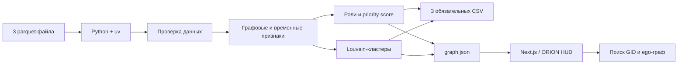

# ORION — Граф денег

Объяснимый аналитический инструмент для AML-аналитика банка. ORION восстанавливает
структуру финансовой сети по обезличенным транзакциям, присваивает каждому узлу
роль и формирует приоритетную очередь для углублённой проверки.

Главный вопрос продукта: **кого из 2 248 клиентов смотреть первым и почему?**

> Роли и приоритеты являются гипотезами для проверки. Они не доказывают
> причастность клиента к незаконной деятельности.

## Что реализовано

- воспроизводимый локальный пайплайн от трёх parquet-файлов до результатов;
- проверка консистентности агрегированных рёбер и отдельных транзакций;
- структурные метрики: степени, обороты, PageRank, betweenness и достижимость из seed;
- временные признаки прохождения средств в течение одного-двух дней;
- шесть объяснимых ролей и `role_score` для всех 2 248 узлов;
- детерминированная кластеризация Louvain, включая изолированные seed;
- отдельный `priority_score` и топ-50 узлов с числовым обоснованием;
- защита от ложных terminal-ролей на границе четвёртого колена;
- интерактивный интерфейс: точный поиск 18-значного GID, карточка узла и направленный ego-граф;
- обзор всех кластеров: размер, seed, внутренний оборот, гипотеза и переход к участникам;
- фильтры по роли и кластеру для полного сохранённого топ-50 с обоснованиями;
- явные состояния загрузки, ошибки и пустого результата без подмены демоданными;
- автоматический валидатор обязательных схем и ограничений.

## Как работает решение

1. Аналитик запускает `npm run analyze` для обработки `nodes.parquet`,
   `edges.parquet` и `transactions.parquet`.
2. Python-пайплайн проверяет данные, считает признаки, роли, кластеры и
   приоритеты. Он записывает три CSV в `out/` и данные интерфейса в
   `public/data/`.
3. В браузере аналитик нажимает «Загрузить результат» и видит сохранённый
   результат: показатели, схему связей выбранного узла и очередь проверки.
4. Аналитик выбирает строку топ-листа или вводит точный `gid`. ORION показывает
   локальные связи, направление потоков, роль, score и числовое обоснование.
5. Файлы `out/nodes_roles.csv`, `out/clusters.csv` и `out/top_nodes.csv` доступны
   для дальнейшего анализа.

Кнопка в браузере только загружает ранее рассчитанный `graph.json`. Индикатор
загрузки отражает ожидание файла, а не этапы расчёта. Новый пересчёт parquet
запускается командой `npm run analyze`, а не браузерной кнопкой. После него
нажмите «Обновить сохранённый результат». Ошибка HTTP или некорректный JSON
показываются явно; скрытого перехода на тестовые данные нет.

В обзоре кластеров выберите сообщество: справа появятся участники с переходом
к карточке GID. Для крупных кластеров отображаются **20 узлов с наибольшим
сохранённым priority_score**, а размер выборки явно указан. Поиск GID работает
по всей сети независимо от выборки и фильтров. Кнопка «Кандидаты кластера»
открывает очередь с соответствующим фильтром. Фильтры применяются ко всему
экспортированному топ-50, не пересчитывают score и не перенумеровывают места.
Пустой топ по фильтрам не означает отсутствия таких узлов во всей сети.
Ego-граф показывает до 14 направленных связей по сумме с явным счётчиком;
стрелки означают направление денег, кольцо — seed, контур — роль-гипотезу.

## Технологии

- Python 3.11–3.13, pandas, PyArrow, NumPy, SciPy, NetworkX;
- uv и зафиксированные зависимости в `uv.lock`;
- Next.js 16, React 19, TypeScript, Tailwind CSS 4, shadcn/ui;
- ORION HUD: тема, фон-шейдер, motion-хелперы и референсная галерея.

AI-модели, внешние API и облачные сервисы в текущем аналитическом сценарии не
используются. Пакет `openai` установлен в веб-проекте, но вызовов модели в этом
решении нет.

## Архитектура проекта



- `pipeline/src/money_graph/` — расчёты, правила, экспорт и валидация;
- `data/` — обезличенные данные организаторов;
- `out/` — пересчитываемые CSV, не коммитятся;
- `public/data/graph.json` и `run_log.json` — браузерные данные и журнал расчёта;
- `components/agent/` — интерактивный сценарий аналитика;
- `lib/graph-types.ts` — контракт между результатами пайплайна и интерфейсом.

## Правила ролей

Роль выбирается только среди формально допустимых кандидатов. Если подходит
несколько ролей, выбирается роль с наибольшим специализированным score.

| Роль | Формальное условие-кандидат | Основные сигналы уверенности |
|---|---|---|
| `consolidator` | не seed, не `depth=4`; ≥3 отправителей; удержание ≥35% либо входящих контрагентов больше исходящих | число и сумма входов, удержание, число достижимых seed |
| `transit` | не seed, есть вход и выход; отношение `out_kzt / in_kzt` от 0,7 до 1,3 | близость коэффициента к 1, быстрый выход ≤2 дней, betweenness |
| `distributor` | ≥10 получателей; получателей минимум в 1,5 раза больше отправителей | веерность, исходящая сумма и число переводов |
| `terminal` | не seed, `depth<4`, есть вход; выхода нет либо ушло ≤15% входящего | удержание, входящая сумма и число отправителей |
| `coordinator` | ≥2 входящих и ≥2 исходящих контрагента; высокий betweenness либо достижимость из ≥7 seed | betweenness, PageRank, seed reach и двусторонняя связность |
| `peripheral` | ни одно из условий выше не выполнено | отсутствие сильного сигнала; отдельно объясняется изоляция или обрыв `depth=4` |

У seed не используются роли, основанные на полном входящем балансе: граф собран
от них по исходящим переводам, поэтому их `in_kzt` системно занижен.

## Приоритет

`priority_score` не равен уверенности в роли. Он отвечает на вопрос очерёдности
проверки и строится как нормированная комбинация:

- 30% — сигнал координатора;
- 20% — сигнал консолидации;
- 16% — сигнал распределения;
- 12% — сигнал транзита;
- 10% — PageRank;
- 8% — betweenness;
- 4% — достижимость из seed;
- небольшой бонус ранее неизвестным, не-seed узлам.

Для изолированных и обрезанных четвёртым коленом узлов применяется понижающий
коэффициент.

## Установка и запуск

Требования: Node.js 20+, npm и [uv](https://docs.astral.sh/uv/).

```bash
npm ci
npm run analyze
npm run dev
```

Интерфейс откроется на [http://localhost:3000](http://localhost:3000).

`npm run analyze` использует `uv.lock`, создаёт:

- `out/nodes_roles.csv`;
- `out/clusters.csv`;
- `out/top_nodes.csv`;
- `out/graph.json` (внутренний экспорт);
- `public/data/graph.json` и `public/data/run_log.json`.

Python-часть не требует ручного создания virtualenv и не использует внешние API.

## Как проверить решение

```bash
npm run analyze
npm run test:pipeline
npm run lint
npm run build
```

Проверки UI-данных без дополнительных библиотек (Node.js 22.6+): `npm run test:ui`.
Они проверяют контракт реального JSON, строковые GID, индексы кластеров,
совместную фильтрацию, неизменность рангов/score и пустые/повреждённые данные.

Ожидаемый результат на приложенном датасете:

- 2 248 строк в `nodes_roles.csv`;
- 91 кластер, из них 8 содержат более одного seed;
- 50 строк в `top_nodes.csv`;
- все роли, evidence и score заполнены;
- полный пересчёт занимает меньше пяти минут (на тестовой машине — менее секунды
  после установки зависимостей).

Для проверки в браузере откройте `http://localhost:3000`, нажмите
«Загрузить результат», откройте кластер и карточку участника, примените фильтры
топ-листа, затем найдите
`100000002398779100`. Интерфейс покажет гипотезу консолидации и локальные
денежные связи этого узла. CSV можно открыть в `out/`.

## Данные и интеграции

Используется только обезличенный датасет организаторов HackAlem AI за июль 2026:
2 248 обезличенных GID, 3 119 рёбер и 4 840 транзакций. Внешнее обогащение и
персональные данные не используются.

GID имеют тип `int64` и превышают безопасный диапазон JavaScript. Поэтому в
`graph.json` и TypeScript они представлены строками без потери цифр.

## Ограничения

- видны только внутрибанковские исходящие переводы;
- граф обрывается после четвёртого колена;
- операции меньше 5 000 KZT отсутствуют;
- нет клиентских атрибутов и размеченных истинных ролей;
- role score отражает силу структурной гипотезы, а не вероятность нарушения;
- Louvain выполняется на взвешенной неориентированной проекции, а роли — на
  исходном направленном графе;
- AI-ассистент пока не реализован;
- браузер не запускает Python-пайплайн повторно; он читает результат последнего
  расчёта из `public/data/graph.json`;
- обработка графов порядка миллиона узлов не проверялась: текущий пайплайн
  использует NetworkX и загружает данные в память.

Визуальная дизайн-система ORION HUD была подготовлена командой до хакатона.
Продуктовый сценарий, аналитический пайплайн, правила ролей, приоритизация и
интеграция с данными созданы в рамках хакатона.

## Развёрнутая версия

Публичной ссылки пока нет; проект работает локально по инструкции выше.
